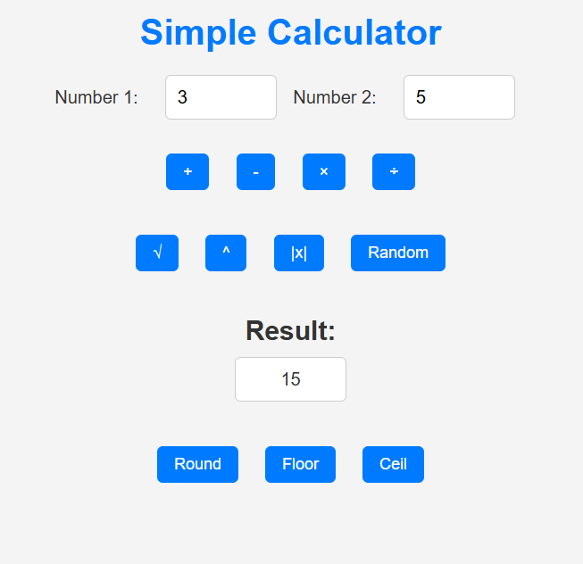

## Simple Calculator Project#

## Description
This project is an interactive web calculator built with HTML, CSS, and JavaScript. It allows users to use a basic and advanced mathematical operations in an intuitive interface. 

## Features
Basic Operations: Addition, subtraction, multiplication, and division.
Advanced Operations:
Square root.
Exponentiation.
Absolute value.
Random number generation within a range.
Result Functions:
Rounding to the nearest integer.
Rounding down (floor).
Rounding up (ceil).

## Technologies Used
HTML5: For structuring the webpage.
CSS3: For styling the user interface and making it responsive.
JavaScript: For handling the logic of operations and user interaction.

## How to Use the Project
Open the index.html file in your browser.
Enter two numbers in the respective fields.
Select an operation to see the result.

## Key Learnings
This project helped to practice concepts:

- DOM manipulation using JavaScript.
- Input validation for user data.
- Creating design with CSS.
- Best practices for clean and structured code.
  
If you’d like to contribute to this project, feel free to submit a pull request or report issues in the Issues section.

Author Name: Nory
License
This project is licensed under the MIT License. For more details, see the LICENSE file.
